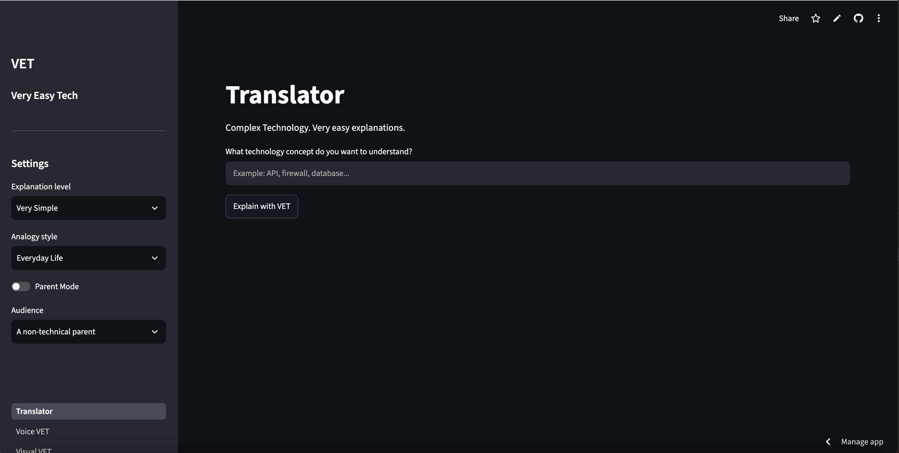
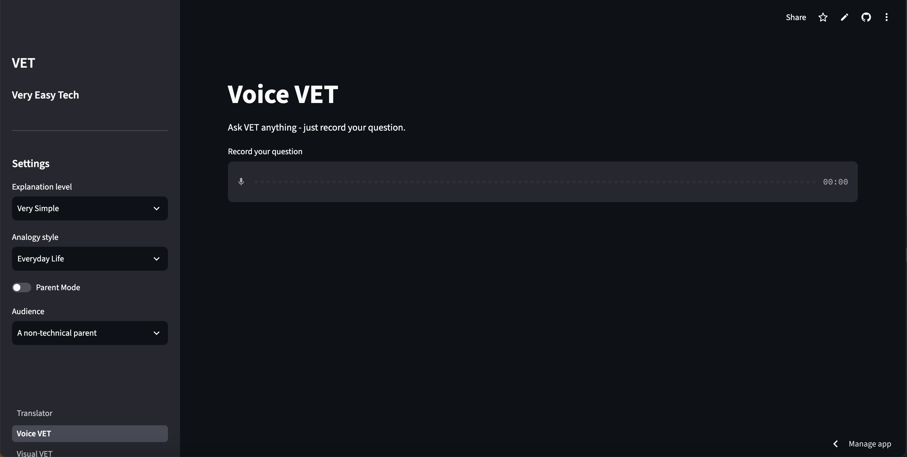
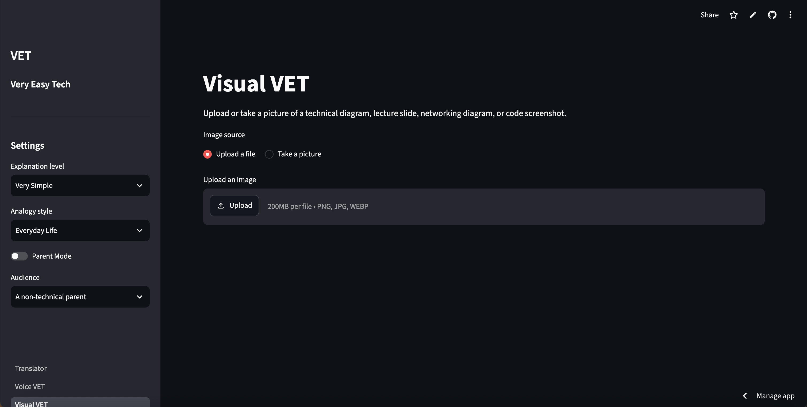
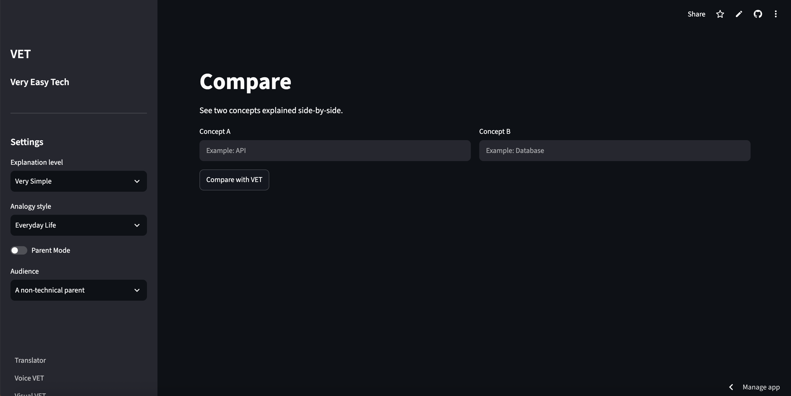
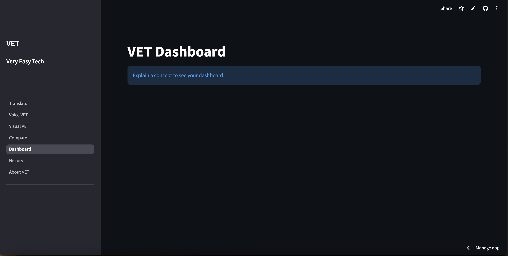

```
██╗   ██╗███████╗████████╗
██║   ██║██╔════╝╚══██╔══╝
██║   ██║█████╗     ██║
╚██╗ ██╔╝██╔══╝     ██║
 ╚████╔╝ ███████╗   ██║
  ╚═══╝  ╚══════╝   ╚═╝
```

# VET
### Very Easy Tech

> Complex technology.
> Very easy explanations.

```
$ vet --explain "anything"
> translating jargon into plain english...
> done.
```

**[ LIVE DEMO ](https://vet-tsion.streamlit.app/)**

**[ DEMO VIDEO ](https://drive.google.com/file/d/104ocJtxfeQ7LbzmyUstVuP6YzPaRe-X7/view?usp=sharing)**

**[ LINKEDIN POST ](https://lnkd.in/p/gVK7Y9aX)**

────────────────────────────

```
01. Problem
02. Solution
03. Features
04. Architecture
05. AI Architecture
06. Tech Stack
07. Project Structure
08. Installation
09. Environment Variables
10. Deployment
11. Screenshots
12. Future Improvements
```

────────────────────────────

## 01. Problem

```
> status: technical_jargon_overload

Technology is everywhere, but explanations of it rarely
meet people where they are.

- Documentation assumes prior technical knowledge
- Explanations default to a single generic "beginner" voice
- Parents, students, and non-technical learners are treated
  the same, when they are not the same
- Diagrams, slides, and screenshots require someone else
  to interpret them
```

## 02. Solution

```
> status: initializing_vet

VET is an AI-powered explainer that adapts to WHO is
asking, not just WHAT is being asked.

- Pick a difficulty level, an analogy style, and an audience
- Ask by typing, speaking, or showing a picture
- Get a structured, scored explanation - not a wall of text
```

## 03. Features

```
[x] Translator     - explain any tech concept in text
[x]  Voice VET      - ask a question by recording audio
[x] Visual VET      - analyze diagrams, slides, code screenshots
[x] Compare         - see two concepts explained side-by-side
[x] Parent Mode      - one-toggle audience override
[x] VET Score™      - 0-100 rating of explanation clarity
[x] History         - full log of everything explained
[x] Dashboard       - metrics + concept frequency chart
```

## 04. Architecture

```
User
 ↓
Streamlit UI
 ↓
Input Layer
 ├── Text     (Translator page)
 ├── Voice    (Voice VET page)
 └── Camera   (Visual VET page)
 ↓
Prompt Engine
 ↓
Gemini
 ↓
Structured Response
 ↓
Session State
 ├── Current Explanation
 ├── History
 └── Analytics
 ↓
Pandas
 ↓
Dashboard
```

## 05. AI Architecture

```
> model: gemini-2.5-flash
> mode: multimodal (text / audio / image)
> output: enforced JSON schema (prompt-level)

┌─────────────────────────────────────────────┐
│ SYSTEM_PROMPT                                │
│  - VET persona + 14 explanation rules        │
│  - enforces self-contained, jargon-free tone │
└───────────────────┬───────────────────────────┘
                    │
┌───────────────────▼───────────────────────────┐
│ Prompt Builder                               │
│  - injects: term, difficulty, analogy style, │
│    audience (or Parent Mode override)        │
└───────────────────┬───────────────────────────┘
                    │
┌───────────────────▼───────────────────────────┐
│ Gemini API call                              │
│  - text  -> explain_concept()                │
│  - audio -> transcribe_and_explain()         │
│  - image -> analyze_image()                  │
│  - pair  -> compare_concepts()               │
└───────────────────┬───────────────────────────┘
                    │
┌───────────────────▼───────────────────────────┐
│ Response Handling                            │
│  - strip markdown fences                     │
│  - json.loads()                              │
│  - on failure (429 / 503 / bad JSON):        │
│    return schema-shaped fallback dict        │
└─────────────────────────────────────────────┘
```

## 06. Tech Stack

```
> language     Python 3.11+
> frontend     Streamlit (st.navigation multipage)
> ai           Google Gemini API (google-genai SDK)
> data         Pandas
> storage      st.session_state (in-memory, session-scoped)
> secrets      .streamlit/secrets.toml (gitignored)
```

## 07. Project Structure

```
VET/
├── app.py                 # Navigation entry point, session/client init
├── components/
│   ├── ui.py               # Shared sidebar settings control
│   ├── translator.py        # Text input page
│   ├── voice_vet.py         # Voice input page
│   ├── visual_vet.py        # Image input page
│   ├── compare.py           # Two-concept comparison page
│   ├── dashboard.py         # Metrics + chart
│   ├── history.py           # Full history table
│   └── about.py             # Static info page
├── src/
│   ├── state.py             # Session state initialization
│   ├── gemini_service.py    # All Gemini API calls + error handling
│   ├── prompts.py           # System prompt + text prompt builder
│   └── analytics.py         # (reserved for future analytics logic)
├── docs/
│   ├── architecture.md
│   └── technical_design.md
├── .streamlit/
│   ├── config.toml
│   └── secrets.toml         # GEMINI_API_KEY (gitignored)
└── requirements.txt
```

## 08. Installation

```bash
$ git clone https://github.com/your-username/VET.git
$ cd VET

$ python3 -m venv .venv
$ source .venv/bin/activate        # macOS/Linux
$ .venv\Scripts\activate           # Windows

$ pip install -r requirements.txt

$ streamlit run app.py
```

```
> app running at: http://localhost:8501
```

## 09. Environment Variables

```
> file: .streamlit/secrets.toml   (create this yourself, gitignored)

GEMINI_API_KEY = "your-gemini-api-key-here"
```

```
> get a key: https://aistudio.google.com/app/apikey
```

## 10. Deployment

```
$ deploy --target streamlit-community-cloud

1. Push this repo to GitHub
2. Go to https://share.streamlit.io
3. Connect the repo, set main file path to app.py
4. Add GEMINI_API_KEY under app Settings > Secrets
5. Deploy
```

```
> live_url: https://vet-tsion.streamlit.app/
```

## 11. Screenshots

**Translator**


**Voice VET**


**Visual VET**


**Compare**


**Dashboard**


## 12. Future Improvements

```
[ ] Persistent history (database or file-backed, survives restart)
[ ] Automatic retry with backoff on 503 errors
[ ] Compare Mode history integration with Dashboard/History views
[ ] Dedicated analytics module (src/analytics.py)
[ ] Input validation for gibberish / nonsensical terms
[ ] Export history as CSV/PDF
[ ] Multi-language explanation support
```

────────────────────────────

```
$ echo "built with very easy intentions."
```
## 13. Sources

```
> references consulted during development

Streamlit
https://docs.streamlit.io
> used for the entire UI: st.navigation, st.form,
> st.session_state, st.metric, st.data_editor,
> st.audio_input, st.camera_input, st.bar_chart

Gemini API - Get an API Key
https://aistudio.google.com/app/apikey
> used to generate the GEMINI_API_KEY

Pandas
https://pandas.pydata.org/docs
> used for history/dashboard data aggregation
> (DataFrame, .value_counts(), .nunique(), .mean())

Streamlit Community Cloud
https://share.streamlit.io
> used for live deployment
```