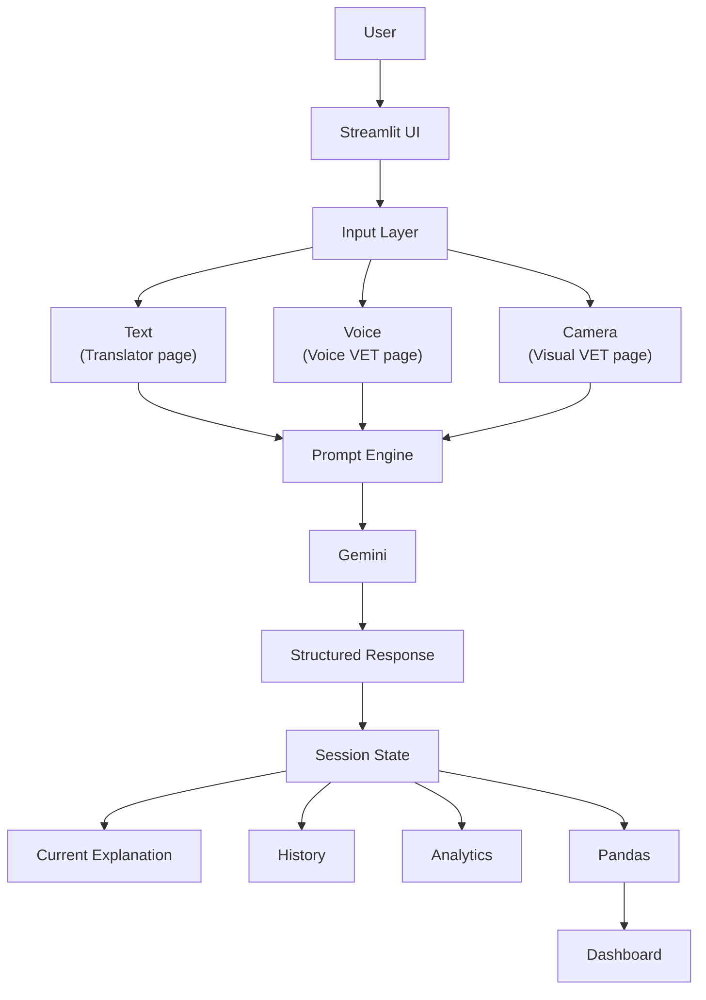

# VET (Very Easy Tech) — Architecture

## Overview

VET is a Streamlit application that uses the Gemini API to translate
technical concepts into plain-language explanations, tailored to a
chosen audience, difficulty level, and analogy style. It supports
four input modes (text, voice, image, and concept comparison) and
scores its own output via a "VET Score."

## Architecture Diagram


## Layer-by-Layer Breakdown

### 1. Streamlit UI

Multi-page navigation via `st.navigation()`, defined in `app.py`.
Seven pages: Translator, Voice VET, Visual VET, Compare, Dashboard,
History, About VET. Shared settings (difficulty, analogy style,
audience, Parent Mode) are rendered once per page via
`components/ui.py::render_settings_sidebar()`, backed by
`st.session_state` keys so selections persist across page navigation.

### 2. Input Layer

Three ways a user's request enters the system:

- **Text** — `st.text_input` on the Translator page. The term is
  passed directly to the Prompt Engine.
- **Voice** — `st.audio_input` on the Voice VET page. Audio bytes
  are sent to Gemini first for transcription, then the transcribed
  text is routed through the same explanation pipeline as Text input.
- **Camera** — `st.file_uploader` / `st.camera_input` on the Visual
  VET page. Image bytes are sent to Gemini directly as multimodal
  input; there is no separate transcription step since Gemini
  interprets the image content itself.

Compare Mode is a variant of the Text input path that takes two
terms instead of one.

### 3. Prompt Engine

Located in `src/prompts.py` and inline within `src/gemini_service.py`
for image/compare prompts. Responsible for:

- Injecting user selections (difficulty, analogy style, audience)
  into a structured instruction template
- Enforcing a fixed JSON output schema so responses can be parsed
  reliably
- Encoding VET's persona and explanation rules (no jargon, one
  concrete analogy, audience-tailored explanation, self-contained
  reasoning that doesn't assume prior context)

### 4. Gemini

All calls go through `google.genai.Client`, using the
`gemini-2.5-flash` model. Four entry points in
`src/gemini_service.py`:

- `explain_concept()` — text-based explanation
- `transcribe_and_explain()` — audio transcription, then delegates
  to `explain_concept()`
- `analyze_image()` — multimodal image analysis
- `compare_concepts()` — two-concept comparison

Each function wraps its API call in error handling for:
- `ClientError` (HTTP 429 — quota/rate limit exceeded)
- `ServerError` (HTTP 503 — Gemini temporarily overloaded)

On either failure, a fallback dict matching the expected success
schema is returned instead of raising, so downstream UI code never
crashes on a missing key.

### 5. Structured Response

Gemini is instructed to return JSON only (no markdown fences, no
prose outside the object). Each function strips any accidental
code-fence wrapping and parses with `json.loads()`. If parsing
fails, a fallback dict (raw text plus `"N/A"` placeholders) is
returned so the schema shape stays consistent regardless of
whether parsing succeeded.

Common response fields include: `simple_definition`,
`everyday_analogy`, `audience_explanation`, `why_it_matters`,
`technical_explanation`, `key_takeaway`, `related_concepts`,
`vet_score`, `rating_label`, `factors`. Image responses add
`identified_subject`; comparison responses use a different shape
built around a two-column `comparison` object plus
`concept_a_summary` / `concept_b_summary`.

### 6. Session State

Initialized once via `src/state.py::init_session_state()`, called
at app startup. Three top-level keys:

- **`current_result`** — the most recent structured response,
  used to render the explanation currently on screen
- **`history`** — a list of dicts, one per completed explanation
  across all input modes (text, voice, image, compare), each
  recording the term, settings used, and VET Score
- **`total_explanations`** — a running count

State is scoped to the active browser session and persists across
page navigation, but resets on a full app restart or browser
refresh (in-memory only; no database or file-based persistence).

### 7. Pandas

`history` (a list of dicts) is converted to a DataFrame in both
`components/dashboard.py` and `components/history.py` for display
and aggregation — computing unique concept counts, Parent Mode
percentage, and average VET Score.

### 8. Dashboard

`components/dashboard.py` renders three `st.metric` cards
(Concepts, VET Score, Parent Mode), a bar chart of concept
frequency (`st.bar_chart`), and (in `components/history.py`) an
editable table of full history (`st.data_editor`).

## File Structure
```
VET/
├── app.py                 # Navigation entry point, session/client init
├── components/
│   ├── ui.py               # Shared sidebar settings control
│   ├── translator.py        # Text input page
│   ├── voice_vet.py         # Voice input page
│   ├── visual_vet.py        # Image input page
│   ├── compare.py           # Two-concept comparison page
│   ├── dashboard.py         # Metrics + chart
│   ├── history.py           # Full history table
│   └── about.py             # Static info page
├── src/
│   ├── state.py             # Session state initialization
│   ├── gemini_service.py    # All Gemini API calls + error handling
│   ├── prompts.py           # System prompt + text prompt builder
│   └── analytics.py         # (reserved for future analytics logic)
└── .streamlit/
    └── secrets.toml         # GEMINI_API_KEY (gitignored)
```

## Known Limitations

- **No persistence across restarts** — history lives only in
  `st.session_state`, so it is lost on server restart or browser
  refresh. Would require a file or database backend to survive
  those events.
- **Free-tier rate limits** — the Gemini free tier caps requests
  per day (observed limit: 20 requests/day for
  `gemini-2.5-flash`); heavy testing can exhaust this quickly.
- **JSON parsing is best-effort** — Gemini is instructed to return
  strict JSON, but occasional malformed responses fall back to a
  raw-text placeholder rather than a fully structured explanation.